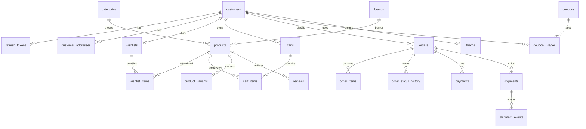

# PostgreSQL Schema & ER — Shopping + Shared Tables

**Database:** `classic_way` (shared with `classic-way-admin`)  
**Migrations:** owned by **classic-way-admin** Alembic  
**Shopping role:** customer-facing reads/writes only (see access column)  
**IDs:** UUID primary keys unless noted  
**Money:** `Numeric(12, 2)`  
**Timestamps:** `created_at` / `updated_at` via `server_default=now()`; soft delete via `deleted_at` where present

---

## 1. Access legend

| Tag | Meaning |
|-----|---------|
| **W** | Shopping may insert/update/delete (customer flows) |
| **R** | Shopping read-only |
| **W*** | Shopping writes only as side-effect of checkout/payment (limited columns) |

---

## 2. Identity & session

### `customers` — **W**

| Column | Type | Notes |
|--------|------|-------|
| id | UUID PK | |
| email | VARCHAR(255) UNIQUE INDEX | |
| full_name | VARCHAR(160) | |
| phone | VARCHAR(40) NULL | |
| hashed_password | VARCHAR(255) | Argon2 via pwdlib |
| is_active | BOOLEAN | default true |
| email_verified | BOOLEAN | default false |
| created_at | TIMESTAMP | |
| updated_at | TIMESTAMP | |
| deleted_at | TIMESTAMP NULL | soft delete |

### `refresh_tokens` — **W**

| Column | Type | Notes |
|--------|------|-------|
| id | UUID PK | |
| customer_id | UUID FK → customers.id CASCADE | |
| token_hash | VARCHAR(255) UNIQUE INDEX | store hash only |
| expires_at | TIMESTAMP | |
| revoked_at | TIMESTAMP NULL | |
| created_at | TIMESTAMP | |

**Indexes:** `email`; `token_hash`; FK index on `customer_id`.

---

## 3. Addresses

### `customer_addresses` — **W**

| Column | Type | Notes |
|--------|------|-------|
| id | UUID PK | |
| user_id | UUID NULL INDEX | legacy admin column; unused by storefront |
| customer_id | UUID NULL FK → customers.id CASCADE | storefront owner |
| full_name | VARCHAR(160) | |
| phone | VARCHAR(40) | |
| line1 | VARCHAR(255) | |
| line2 | VARCHAR(255) NULL | |
| city | VARCHAR(100) | |
| state | VARCHAR(100) | |
| postal_code | VARCHAR(20) | |
| country | VARCHAR(100) | default India |
| is_default | BOOLEAN | |
| created_at / updated_at | TIMESTAMP | |

**Rules:** at most one `is_default=true` per customer (enforced in app).

---

## 4. Catalog (admin-owned content) — **R**

### `categories`

| Column | Type | Notes |
|--------|------|-------|
| id | UUID PK | |
| name | VARCHAR(120) | |
| slug | VARCHAR(140) UNIQUE INDEX | |
| description | TEXT NULL | |
| image_url | VARCHAR(500) NULL | |
| parent_id | UUID NULL FK → categories.id CASCADE | tree |
| is_active | BOOLEAN | |
| sort_order | INTEGER | |
| created_at / updated_at | TIMESTAMP | |

### `brands`

| Column | Type | Notes |
|--------|------|-------|
| id | UUID PK | |
| name | VARCHAR(120) | |
| slug | VARCHAR(140) UNIQUE INDEX | |
| is_active | BOOLEAN | |
| created_at / updated_at | TIMESTAMP | |

### `products`

| Column | Type | Notes |
|--------|------|-------|
| id | UUID PK | |
| name | VARCHAR(160) | |
| slug | VARCHAR(180) UNIQUE INDEX | |
| description / short_description | TEXT NULL | |
| price | NUMERIC(12,2) | |
| compare_at_price | NUMERIC(12,2) NULL | |
| discount_percent | NUMERIC(5,2) NULL | |
| sku | VARCHAR(64) UNIQUE NULL | |
| manufacturer_name / manufacturer_brand | VARCHAR(160) NULL | |
| stock | INTEGER | denormalized; prefer inventory_items |
| tags | VARCHAR(500) NULL | |
| visibility | VARCHAR(32) | default public |
| published_at | TIMESTAMP NULL | |
| category_id | UUID NULL FK → categories SET NULL | |
| brand_id | UUID NULL FK → brands SET NULL | |
| is_published / is_active | BOOLEAN | |
| is_featured / is_trending / is_best_seller | BOOLEAN | |
| seo_title / seo_description | VARCHAR | |
| exchangeable / refundable | BOOLEAN | |
| sort_order | INTEGER | |
| created_at / updated_at | TIMESTAMP | |
| deleted_at | TIMESTAMP NULL | soft delete |

**Storefront filter:** `is_published`, `is_active`, `deleted_at IS NULL`, visibility public.

### `product_media` — **R**

id PK, product_id FK CASCADE, url, alt_text, sort_order, is_primary, created_at

### `product_attributes` — **R**

id PK, product_id FK, name, values JSON, sort_order, created_at

### `product_variants` — **R**

id PK, product_id FK, sku UNIQUE, price NULL, stock, options JSON, is_active, sort_order, timestamps

---

## 5. Inventory & store config — **R** / **W***

### `inventory_settings` — **R**

Singleton-ish thresholds (`low_stock_threshold`).

### `inventory_items` — **R** / **W*** (reserve on checkout)

| Column | Type |
|--------|------|
| id | UUID PK |
| product_id | UUID NULL FK |
| variant_id | UUID NULL FK |
| sku | VARCHAR(64) INDEX |
| quantity | INTEGER |
| reserved | INTEGER |
| updated_at | TIMESTAMP |

### `stock_movements` — **R** / **W*** (audit on reserve)

id, inventory_item_id FK, delta, reason, reference, created_at

### `store_settings` — **R**

Store identity, currency (INR), timezone.

### `tax_rules` — **R**

code UNIQUE, rate_percent, is_inclusive, country/state, is_active, sort_order

### `coupons` — **R** / **W*** (`used_count` on redeem)

| Column | Type |
|--------|------|
| id | UUID PK |
| code | VARCHAR(40) UNIQUE INDEX |
| name | VARCHAR(160) |
| discount_type | VARCHAR(16) |
| discount_value | NUMERIC(12,2) |
| min_order_amount | NUMERIC NULL |
| max_uses / used_count | INTEGER |
| starts_at / ends_at | TIMESTAMP NULL |
| is_active | BOOLEAN |
| timestamps | |

---

## 6. Cart — **W**

### `carts`

| Column | Type | Notes |
|--------|------|-------|
| id | UUID PK | also sent as `X-Cart-Id` |
| session_key | VARCHAR(120) NULL INDEX | |
| user_id | UUID NULL INDEX | legacy |
| customer_id | UUID NULL FK → customers SET NULL | |
| coupon_code | VARCHAR(40) NULL | |
| created_at / updated_at | TIMESTAMP | |

### `cart_items`

| Column | Type |
|--------|------|
| id | UUID PK |
| cart_id | UUID FK → carts CASCADE |
| product_id | UUID FK → products CASCADE |
| variant_id | UUID NULL FK → product_variants SET NULL |
| quantity | INTEGER |
| unit_price | NUMERIC(12,2) snapshot |
| product_name | VARCHAR(160) snapshot |
| sku | VARCHAR(64) NULL |

---

## 7. Engagement — **W**

### `wishlists` / `wishlist_items`

- wishlist: id, customer_id UNIQUE FK CASCADE, timestamps  
- item: id, wishlist_id FK, product_id FK, created_at  
- **UQ** `(wishlist_id, product_id)`

### `compare_lists` / `compare_items`

Same pattern; **UQ** `(compare_list_id, product_id)`

### `reviews` / `review_images`

| reviews | |
|---------|--|
| id | UUID PK |
| product_id | FK CASCADE |
| customer_id | FK CASCADE |
| rating | INTEGER 1–5 |
| title / body | |
| is_verified_purchase | BOOLEAN |
| is_approved | BOOLEAN (admin moderation) |
| timestamps | |

`review_images`: id, review_id FK, url, sort_order, created_at

### `coupon_usages` — **W**

id, coupon_id FK, customer_id FK, order_id NULL FK SET NULL, used_at, discount_amount

### `feedbacks` — **W**

id, customer_id NULL FK SET NULL, name, email, subject, message, status default `new`, created_at

---

## 8. Commerce — orders & payments

### `orders` — **W** (create/cancel customer paths)

| Column | Type | Notes |
|--------|------|-------|
| id | UUID PK | |
| order_number | VARCHAR(40) UNIQUE INDEX | |
| user_id | UUID NULL INDEX | legacy |
| customer_id | UUID NULL FK SET NULL | |
| status | VARCHAR(20) INDEX | draft/pending/paid/shipped/cancelled/… |
| payment_method | VARCHAR(20) | cod / razorpay |
| subtotal / shipping_amount / tax_amount / discount_amount / total | NUMERIC(12,2) | |
| currency | VARCHAR(8) | INR |
| shipping_* | address snapshot fields | |
| coupon_code | VARCHAR(40) NULL | |
| notes | TEXT NULL | |
| timestamps | | |

### `order_items` — **W**

id, order_id FK CASCADE, product_id NULL SET NULL, variant_id NULL SET NULL, sku, name, quantity, unit_price, line_total

### `order_status_history` — **W**

id, order_id FK, from_status NULL, to_status, note NULL, created_at — **audit trail**

### `payments` — **W** (create/verify)

id, order_id FK CASCADE, provider, provider_order_id INDEX, provider_payment_id INDEX, amount, currency, status, method, raw_payload, timestamps

### `payment_events` — **R** (prefer admin/webhook ingestion)

id, payment_id NULL FK, event_id UNIQUE, event_type, signature_valid, payload, created_at

### `refunds` — **R**

id, payment_id FK, order_id FK, amount, reason, status, provider_refund_id, created_at

---

## 9. Fulfillment — **R**

### `courier_accounts` — **R**

Admin-configured providers.

### `shipments` — **R**

id, order_id FK, courier_provider, awb INDEX, label_url, status, pickup_scheduled_at, exception_flag/reason, timestamps

### `shipment_events` — **R**

id, shipment_id FK, status, message, event_at, source

---

## 10. Theme — **W** (customer row) / **R** (default)

### `theme`

| Column | Type | Notes |
|--------|------|-------|
| id | UUID PK | |
| customer_id | UUID NULL UNIQUE FK CASCADE | NULL = global |
| home_theme / shop_category / shop_layout / product_layout / blog_layout | VARCHAR | |
| page_visibility | JSON | |
| theme_config | JSON NULL | |
| is_default | BOOLEAN INDEX | global default flag |
| is_active | BOOLEAN | |
| timestamps | | |

Shopping: read default; upsert own `customer_id` row. Do not mass-edit global defaults from random customers.

---

## 11. Shopping-owned engagement tables — **W**

### `notifications`

| Column | Type |
|--------|------|
| id | UUID PK |
| customer_id | UUID FK CASCADE INDEX |
| type | VARCHAR(32) |
| title | VARCHAR(200) |
| body | TEXT |
| link_url | VARCHAR(500) NULL |
| reference_type / reference_id | VARCHAR NULL |
| is_read | BOOLEAN default false |
| created_at | TIMESTAMP |
| read_at | TIMESTAMP NULL |
| deleted_at | TIMESTAMP NULL |

**Indexes:** `(customer_id, is_read, created_at DESC)`

### `recently_viewed`

| Column | Type |
|--------|------|
| id | UUID PK |
| customer_id | UUID FK CASCADE |
| product_id | UUID FK CASCADE |
| viewed_at | TIMESTAMP |

**UQ:** `(customer_id, product_id)`  
**Index:** `(customer_id, viewed_at DESC)`

### `support_tickets` / `support_messages`

**tickets:** id, customer_id FK, order_id NULL FK, subject, category, status, timestamps, closed_at  
**messages:** id, ticket_id FK CASCADE, sender_type (`customer`|`agent`), body TEXT, created_at  

Shopping writes customer tickets/messages only.

### Optional later: `product_rating_summaries`

product_id PK/FK, average, count, distribution JSON, updated_at — maintained by job or trigger; shopping **R** (or **W*** if shopping maintains on review create).

---

## 12. Soft delete & audit conventions

| Pattern | Where |
|---------|--------|
| Soft delete | `customers.deleted_at`, `products.deleted_at` |
| Hard delete OK | cart items, wishlist items, refresh tokens (revoke), addresses |
| Status audit | `order_status_history`, `shipment_events`, `payment_events`, `stock_movements` |
| Snapshots | cart_items & order_items store name/price at write time |
| Legacy columns | `user_id` on carts/orders/addresses — ignore for storefront ownership |

---

## 13. ER relationships (logical)

```text
customers 1──* refresh_tokens
customers 1──* customer_addresses
customers 1──1 wishlists 1──* wishlist_items *──1 products
customers 1──1 compare_lists 1──* compare_items *──1 products
customers 1──* reviews *──1 products
reviews 1──* review_images
customers 1──* carts 1──* cart_items *──1 products
cart_items *──0..1 product_variants
customers 1──* orders 1──* order_items
orders 1──* order_status_history
orders 1──* payments 1──* payment_events
payments 1──* refunds
orders 1──* shipments 1──* shipment_events
coupons 1──* coupon_usages *──1 customers
categories 1──* products
brands 1──* products
products 1──* product_media | product_attributes | product_variants
products 0..1── inventory_items ──* stock_movements
customers 0..1── theme (override) ; theme(is_default) global
customers 1──* notifications
customers 1──* recently_viewed
customers 1──* support_tickets 1──* support_messages
```

### Mermaid ER (core)



---

## 14. Recommended indexes (beyond PK/unique)

| Table | Index |
|-------|-------|
| products | `(is_published, is_active, deleted_at)`, `(category_id)`, `(brand_id)`, `(is_featured)`, GIN/FTS on name later |
| orders | `(customer_id, created_at DESC)`, `(status)` |
| cart_items | `(cart_id)` |
| reviews | `(product_id, is_approved)`, `(customer_id, product_id)` unique recommended |
| shipments | `(awb)`, `(order_id)` |
| notifications | `(customer_id, is_read, created_at DESC)` |

---

## 15. Shopping write vs read checklist

| Write (shopping) | Read-only (shopping) |
|------------------|----------------------|
| customers, refresh_tokens | products*, categories, brands, media, attributes, variants |
| customer_addresses | coupons (except used_count), tax_rules, store_settings |
| carts, cart_items | courier_accounts, shipments, shipment_events |
| wishlists*, compare*, reviews*, feedbacks | payment_events, refunds |
| coupon_usages | inventory_settings (and items except reserve path) |
| orders*, order_items, order_status_history | |
| payments (create/verify) | |
| theme (customer override) | theme (global default read) |
| notifications, recently_viewed, support_* | |

\*Plus limited inventory reservation during checkout.
